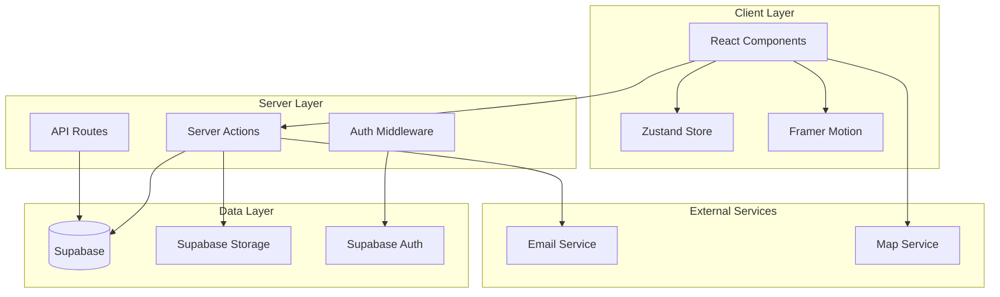
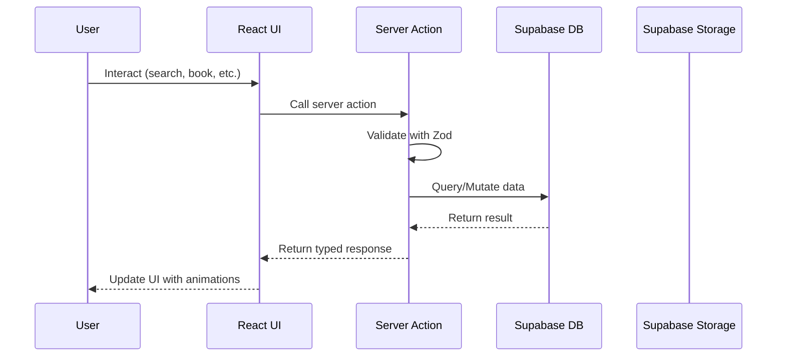
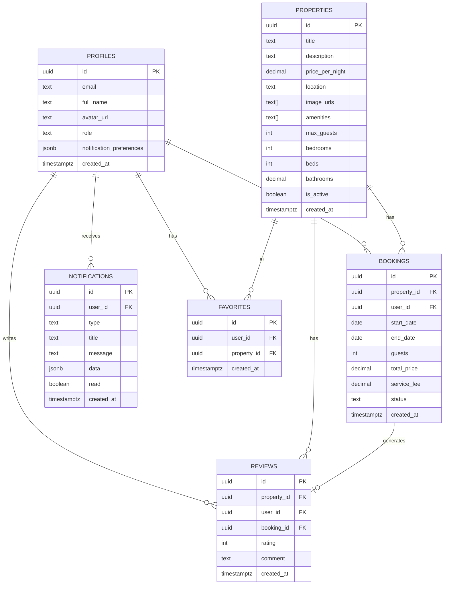

# Design Document: Hotel Booking Enhancement

## Overview

This design document outlines the technical architecture and implementation approach for enhancing the existing hotel booking application. The enhancement builds upon the current Next.js 15 + Supabase stack, adding comprehensive property management, advanced booking features, search capabilities, animations, and responsive design improvements.

The design follows a modular architecture with clear separation between:

- **Presentation Layer**: React components with shadcn/ui, Tailwind CSS, and Framer Motion
- **Business Logic Layer**: Server Actions and API routes with Zod validation
- **Data Layer**: Supabase PostgreSQL with Row Level Security (RLS)
- **State Management**: Zustand for client state, React Query patterns for server state

## Architecture



### Data Flow Architecture



## Components and Interfaces

### Property Management Components

```typescript
// src/types/property.types.ts
interface Property {
  id: string;
  title: string;
  description: string | null;
  price_per_night: number;
  location: string;
  image_urls: string[];
  amenities: string[];
  max_guests: number;
  bedrooms: number;
  beds: number;
  bathrooms: number;
  rating: number | null;
  review_count: number;
  is_active: boolean;
  created_at: string;
  updated_at: string;
}

interface PropertyFormData {
  title: string;
  description: string;
  price_per_night: number;
  location: string;
  max_guests: number;
  bedrooms: number;
  beds: number;
  bathrooms: number;
  amenities: string[];
}

interface PropertyFilters {
  location?: string;
  checkIn?: Date;
  checkOut?: Date;
  guests?: number;
  minPrice?: number;
  maxPrice?: number;
  amenities?: string[];
  sortBy?: "price_asc" | "price_desc" | "rating" | "newest";
}
```

### Booking System Components

```typescript
// src/types/booking.types.ts
interface Booking {
  id: string;
  property_id: string;
  user_id: string;
  start_date: string;
  end_date: string;
  guests: number;
  total_price: number;
  service_fee: number;
  status: "pending" | "confirmed" | "cancelled" | "completed";
  created_at: string;
  updated_at: string;
}

interface BookingWithDetails extends Booking {
  property: Pick<
    Property,
    "id" | "title" | "location" | "image_urls" | "price_per_night"
  >;
  user: Pick<Profile, "id" | "email" | "full_name">;
}

interface CreateBookingInput {
  property_id: string;
  start_date: Date;
  end_date: Date;
  guests: number;
}

interface BookingPriceCalculation {
  nights: number;
  nightly_rate: number;
  subtotal: number;
  service_fee: number;
  total: number;
}
```

### Search Engine Interface

```typescript
// src/types/search.types.ts
interface SearchParams {
  query?: string;
  location?: string;
  checkIn?: string;
  checkOut?: string;
  guests?: number;
  minPrice?: number;
  maxPrice?: number;
  amenities?: string[];
  page?: number;
  limit?: number;
  sortBy?: SortOption;
}

type SortOption =
  | "relevance"
  | "price_asc"
  | "price_desc"
  | "rating"
  | "newest";

interface SearchResult {
  properties: Property[];
  total: number;
  page: number;
  totalPages: number;
  hasMore: boolean;
}

interface AvailabilityCheck {
  property_id: string;
  start_date: Date;
  end_date: Date;
}

interface AvailabilityResult {
  available: boolean;
  conflicting_dates?: { start: string; end: string }[];
}
```

### Review System Interface

```typescript
// src/types/review.types.ts
interface Review {
  id: string;
  property_id: string;
  user_id: string;
  rating: number;
  comment: string | null;
  created_at: string;
  updated_at: string;
}

interface ReviewWithUser extends Review {
  user: Pick<Profile, "id" | "full_name" | "avatar_url">;
}

interface CreateReviewInput {
  property_id: string;
  rating: number;
  comment?: string;
}

interface PropertyRating {
  average: number;
  count: number;
  distribution: Record<1 | 2 | 3 | 4 | 5, number>;
}
```

### Notification System Interface

```typescript
// src/types/notification.types.ts
interface Notification {
  id: string;
  user_id: string;
  type: NotificationType;
  title: string;
  message: string;
  data: Record<string, unknown>;
  read: boolean;
  created_at: string;
}

type NotificationType =
  | "booking_confirmed"
  | "booking_cancelled"
  | "booking_reminder"
  | "review_received"
  | "system";

interface NotificationPreferences {
  email_booking_confirmation: boolean;
  email_booking_reminder: boolean;
  email_marketing: boolean;
  push_enabled: boolean;
}
```

### UI Component Interfaces

```typescript
// src/components/property/PropertyCard.tsx
interface PropertyCardProps {
  property: Property;
  onFavorite?: (id: string) => void;
  isFavorited?: boolean;
  showRating?: boolean;
}

// src/components/booking/BookingWidget.tsx
interface BookingWidgetProps {
  property: Property;
  onBookingComplete?: (booking: Booking) => void;
}

// src/components/search/SearchBar.tsx
interface SearchBarProps {
  initialValues?: Partial<SearchParams>;
  onSearch: (params: SearchParams) => void;
  variant?: "hero" | "compact";
}

// src/components/ui/AnimatedList.tsx
interface AnimatedListProps<T> {
  items: T[];
  renderItem: (item: T, index: number) => React.ReactNode;
  keyExtractor: (item: T) => string;
  staggerDelay?: number;
  animation?: "fade" | "slide" | "scale";
}
```

## Data Models

### Enhanced Database Schema

```sql
-- Profiles table (enhanced)
CREATE TABLE profiles (
  id UUID PRIMARY KEY REFERENCES auth.users(id) ON DELETE CASCADE,
  email TEXT NOT NULL,
  full_name TEXT,
  avatar_url TEXT,
  phone TEXT,
  role TEXT DEFAULT 'user' CHECK (role IN ('user', 'admin')),
  notification_preferences JSONB DEFAULT '{}',
  created_at TIMESTAMPTZ DEFAULT NOW(),
  updated_at TIMESTAMPTZ DEFAULT NOW()
);

-- Properties table (enhanced)
CREATE TABLE properties (
  id UUID PRIMARY KEY DEFAULT gen_random_uuid(),
  title TEXT NOT NULL,
  description TEXT,
  price_per_night DECIMAL(10,2) NOT NULL CHECK (price_per_night > 0),
  location TEXT NOT NULL,
  latitude DECIMAL(10,8),
  longitude DECIMAL(11,8),
  image_urls TEXT[] DEFAULT '{}',
  amenities TEXT[] DEFAULT '{}',
  max_guests INTEGER NOT NULL DEFAULT 1 CHECK (max_guests > 0),
  bedrooms INTEGER DEFAULT 1,
  beds INTEGER DEFAULT 1,
  bathrooms DECIMAL(3,1) DEFAULT 1,
  is_active BOOLEAN DEFAULT true,
  created_at TIMESTAMPTZ DEFAULT NOW(),
  updated_at TIMESTAMPTZ DEFAULT NOW()
);

-- Bookings table (enhanced)
CREATE TABLE bookings (
  id UUID PRIMARY KEY DEFAULT gen_random_uuid(),
  property_id UUID NOT NULL REFERENCES properties(id) ON DELETE CASCADE,
  user_id UUID NOT NULL REFERENCES profiles(id) ON DELETE CASCADE,
  start_date DATE NOT NULL,
  end_date DATE NOT NULL,
  guests INTEGER NOT NULL DEFAULT 1,
  total_price DECIMAL(10,2) NOT NULL,
  service_fee DECIMAL(10,2) NOT NULL DEFAULT 0,
  status TEXT DEFAULT 'pending' CHECK (status IN ('pending', 'confirmed', 'cancelled', 'completed')),
  special_requests TEXT,
  created_at TIMESTAMPTZ DEFAULT NOW(),
  updated_at TIMESTAMPTZ DEFAULT NOW(),
  CONSTRAINT valid_dates CHECK (end_date > start_date),
  CONSTRAINT valid_guests CHECK (guests > 0)
);

-- Reviews table (enhanced)
CREATE TABLE reviews (
  id UUID PRIMARY KEY DEFAULT gen_random_uuid(),
  property_id UUID NOT NULL REFERENCES properties(id) ON DELETE CASCADE,
  user_id UUID NOT NULL REFERENCES profiles(id) ON DELETE CASCADE,
  booking_id UUID REFERENCES bookings(id) ON DELETE SET NULL,
  rating INTEGER NOT NULL CHECK (rating >= 1 AND rating <= 5),
  comment TEXT,
  created_at TIMESTAMPTZ DEFAULT NOW(),
  updated_at TIMESTAMPTZ DEFAULT NOW(),
  UNIQUE(property_id, user_id, booking_id)
);

-- Notifications table (new)
CREATE TABLE notifications (
  id UUID PRIMARY KEY DEFAULT gen_random_uuid(),
  user_id UUID NOT NULL REFERENCES profiles(id) ON DELETE CASCADE,
  type TEXT NOT NULL,
  title TEXT NOT NULL,
  message TEXT NOT NULL,
  data JSONB DEFAULT '{}',
  read BOOLEAN DEFAULT false,
  created_at TIMESTAMPTZ DEFAULT NOW()
);

-- Favorites table (new)
CREATE TABLE favorites (
  id UUID PRIMARY KEY DEFAULT gen_random_uuid(),
  user_id UUID NOT NULL REFERENCES profiles(id) ON DELETE CASCADE,
  property_id UUID NOT NULL REFERENCES properties(id) ON DELETE CASCADE,
  created_at TIMESTAMPTZ DEFAULT NOW(),
  UNIQUE(user_id, property_id)
);

-- Indexes for performance
CREATE INDEX idx_properties_location ON properties(location);
CREATE INDEX idx_properties_price ON properties(price_per_night);
CREATE INDEX idx_properties_active ON properties(is_active) WHERE is_active = true;
CREATE INDEX idx_bookings_property ON bookings(property_id);
CREATE INDEX idx_bookings_user ON bookings(user_id);
CREATE INDEX idx_bookings_dates ON bookings(start_date, end_date);
CREATE INDEX idx_bookings_status ON bookings(status);
CREATE INDEX idx_reviews_property ON reviews(property_id);
CREATE INDEX idx_notifications_user ON notifications(user_id);
CREATE INDEX idx_notifications_unread ON notifications(user_id, read) WHERE read = false;
```

### Zod Validation Schemas

```typescript
// src/lib/validations/property.ts
import { z } from "zod";

export const propertySchema = z.object({
  title: z.string().min(3).max(100),
  description: z.string().max(2000).optional(),
  price_per_night: z.number().positive().max(100000),
  location: z.string().min(2).max(200),
  max_guests: z.number().int().positive().max(50),
  bedrooms: z.number().int().nonnegative().max(20).optional(),
  beds: z.number().int().nonnegative().max(50).optional(),
  bathrooms: z.number().nonnegative().max(20).optional(),
  amenities: z.array(z.string()).optional(),
});

// src/lib/validations/booking.ts
export const bookingSchema = z
  .object({
    property_id: z.string().uuid(),
    start_date: z.coerce
      .date()
      .refine((d) => d >= new Date(), "Start date must be in the future"),
    end_date: z.coerce.date(),
    guests: z.number().int().positive(),
  })
  .refine((data) => data.end_date > data.start_date, {
    message: "End date must be after start date",
    path: ["end_date"],
  });

// src/lib/validations/review.ts
export const reviewSchema = z.object({
  property_id: z.string().uuid(),
  rating: z.number().int().min(1).max(5),
  comment: z.string().max(1000).optional(),
});

// src/lib/validations/search.ts
export const searchSchema = z.object({
  query: z.string().optional(),
  location: z.string().optional(),
  checkIn: z.string().datetime().optional(),
  checkOut: z.string().datetime().optional(),
  guests: z.number().int().positive().optional(),
  minPrice: z.number().nonnegative().optional(),
  maxPrice: z.number().positive().optional(),
  amenities: z.array(z.string()).optional(),
  page: z.number().int().positive().default(1),
  limit: z.number().int().positive().max(50).default(20),
  sortBy: z
    .enum(["relevance", "price_asc", "price_desc", "rating", "newest"])
    .default("relevance"),
});
```

### Entity Relationship Diagram



## Correctness Properties

_A property is a characteristic or behavior that should hold true across all valid executions of a system—essentially, a formal statement about what the system should do. Properties serve as the bridge between human-readable specifications and machine-verifiable correctness guarantees._

### Property 1: Property CRUD Round-Trip

_For any_ valid property data, creating a property and then retrieving it by ID should return a property with all the same field values (except auto-generated fields like id, created_at, updated_at). Similarly, updating a property and retrieving it should reflect the updated values while preserving the original ID.

**Validates: Requirements 1.1, 1.3, 1.6**

### Property 2: Property Validation Rejects Invalid Input

_For any_ property creation or update attempt with missing required fields (title, price_per_night, location, max_guests) or invalid values (negative price, zero max_guests), the Property_Manager should return a validation error and not persist the data.

**Validates: Requirements 1.7**

### Property 3: Soft-Deleted Properties Excluded from Search

_For any_ property that has been soft-deleted (is_active = false), searching for properties should never include that property in the results, regardless of search criteria.

**Validates: Requirements 1.4**

### Property 4: Booking Date Validation

_For any_ booking attempt where check-out date is less than or equal to check-in date, OR where either date is in the past, the Booking_System should reject the booking with a validation error.

**Validates: Requirements 2.1**

### Property 5: Booking Guest Capacity Validation

_For any_ booking attempt where the specified guest count exceeds the property's max_guests value, the Booking_System should reject the booking with a validation error.

**Validates: Requirements 2.2**

### Property 6: Booking Price Calculation

_For any_ valid booking with a given property price_per_night, start_date, and end_date, the calculated total_price should equal (number_of_nights × price_per_night) + service_fee, where service_fee is 10% of the subtotal and number_of_nights equals the difference in days between end_date and start_date.

**Validates: Requirements 2.3**

### Property 7: Booking Availability Check

_For any_ property with existing confirmed bookings, attempting to create a new booking with dates that overlap any existing booking's date range should be rejected. Conversely, bookings with non-overlapping dates should be accepted.

**Validates: Requirements 2.7, 2.8**

### Property 8: Booking Status Transitions

_For any_ confirmed booking that is cancelled, the booking status should be updated to 'cancelled' and the booking should remain in the database (not deleted). For any booking confirmation, the status should be set to 'confirmed'.

**Validates: Requirements 2.4, 2.6**

### Property 9: User Bookings Retrieval

_For any_ user with bookings, retrieving their bookings should return all bookings associated with that user_id, each containing property details, dates, and current status.

**Validates: Requirements 2.5**

### Property 10: Search Filter Correctness

_For any_ search with filters applied (location, date range, guest count, price range, amenities), all returned properties should satisfy ALL specified filter criteria:

- Location filter: property.location contains the search query (case-insensitive)
- Guest filter: property.max_guests >= specified guest count
- Price filter: minPrice <= property.price_per_night <= maxPrice
- Amenities filter: property.amenities contains all specified amenities
- Date filter: property has no conflicting bookings for the date range

**Validates: Requirements 3.1, 3.2, 3.3, 3.4, 3.5**

### Property 11: Search Result Sorting

_For any_ search results with a specified sort option, the results should be ordered correctly:

- price_asc: results ordered by price_per_night ascending
- price_desc: results ordered by price_per_night descending
- rating: results ordered by average rating descending
- newest: results ordered by created_at descending

**Validates: Requirements 3.6**

### Property 12: Authentication Validation

_For any_ registration attempt, email must match a valid email format and password must be at least 8 characters. Invalid inputs should be rejected with validation errors.

**Validates: Requirements 4.1**

### Property 13: Authentication Error Security

_For any_ failed login attempt (invalid email or password), the error message returned should not reveal which specific field was incorrect—only a generic "invalid credentials" message.

**Validates: Requirements 4.5**

### Property 14: Profile Update Round-Trip

_For any_ profile update with valid data, updating the profile and then retrieving it should reflect the updated values while preserving the user ID and email.

**Validates: Requirements 4.3**

### Property 15: Admin Access Control

_For any_ user without admin role attempting to access admin routes, the request should be rejected with a redirect or access denied response. Only users with role='admin' should access admin functionality.

**Validates: Requirements 5.6**

### Property 16: Admin Dashboard Metrics Accuracy

_For any_ admin dashboard view, the displayed metrics should accurately reflect the database state:

- Total bookings count equals count of all bookings
- Total revenue equals sum of all confirmed booking total_prices
- Property count equals count of active properties

**Validates: Requirements 5.1, 5.5**

### Property 17: Review CRUD Round-Trip

_For any_ valid review submission (rating 1-5, optional comment), creating a review and retrieving it should return the same rating and comment. Editing a review should update content while preserving the original created_at timestamp.

**Validates: Requirements 6.1, 6.5**

### Property 18: Review Average Calculation

_For any_ property with one or more reviews, the calculated average rating should equal the sum of all review ratings divided by the count of reviews, rounded to appropriate precision.

**Validates: Requirements 6.3**

### Property 19: Review Eligibility Check

_For any_ user attempting to submit a review for a property, if the user has no completed booking (status='completed') at that property, the review submission should be rejected.

**Validates: Requirements 6.4**

### Property 20: API Input Validation

_For any_ API request with invalid input (failing Zod schema validation), the API should return a 400 status code with a structured error response containing field-specific validation messages.

**Validates: Requirements 9.1, 9.2**

### Property 21: Pagination Correctness

_For any_ paginated query with specified page and limit, the returned results should:

- Contain at most 'limit' items
- Return correct 'total' count of all matching items
- Return correct 'totalPages' calculation
- Return correct 'hasMore' boolean

**Validates: Requirements 9.3**

### Property 22: File Upload Validation

_For any_ file upload attempt, files exceeding 5MB or with invalid types (not JPEG, PNG, or WebP) should be rejected with appropriate error messages.

**Validates: Requirements 1.2, 9.5**

### Property 23: Notification Creation on Booking Events

_For any_ booking confirmation, a notification of type 'booking_confirmed' should be created for the user. For any booking cancellation, notifications should be created for both the user and relevant admin.

**Validates: Requirements 10.1, 10.2**

### Property 24: Notification Read Status Management

_For any_ notification marked as read, the read status should be updated to true in the database. The unread count for a user should equal the count of their notifications where read=false.

**Validates: Requirements 10.4, 10.5**

### Property 25: Loading State Display

_For any_ data fetching operation, while the request is pending, the UI should display skeleton loaders or loading spinners. Once data is received, the loading state should be replaced with actual content.

**Validates: Requirements 7.4, 7.6**

### Property 26: Responsive Grid Columns

_For any_ viewport width, the property card grid should display the correct number of columns:

- Width < 640px: 1 column
- Width 640-767px: 2 columns
- Width 768-1023px: 3 columns
- Width 1024-1279px: 4 columns
- Width 1280-1535px: 5 columns
- Width >= 1536px: 6 columns

**Validates: Requirements 8.5**

## Error Handling

### Client-Side Error Handling

```typescript
// src/lib/errors.ts
export class AppError extends Error {
  constructor(
    message: string,
    public code: string,
    public statusCode: number = 400,
    public details?: Record<string, unknown>,
  ) {
    super(message);
    this.name = "AppError";
  }
}

export class ValidationError extends AppError {
  constructor(message: string, details?: Record<string, string[]>) {
    super(message, "VALIDATION_ERROR", 400, details);
    this.name = "ValidationError";
  }
}

export class AuthenticationError extends AppError {
  constructor(message: string = "Authentication required") {
    super(message, "AUTHENTICATION_ERROR", 401);
    this.name = "AuthenticationError";
  }
}

export class AuthorizationError extends AppError {
  constructor(message: string = "Access denied") {
    super(message, "AUTHORIZATION_ERROR", 403);
    this.name = "AuthorizationError";
  }
}

export class NotFoundError extends AppError {
  constructor(resource: string) {
    super(`${resource} not found`, "NOT_FOUND", 404);
    this.name = "NotFoundError";
  }
}

export class ConflictError extends AppError {
  constructor(message: string) {
    super(message, "CONFLICT", 409);
    this.name = "ConflictError";
  }
}
```

### Server Action Error Handling Pattern

```typescript
// src/lib/action-utils.ts
import { z } from "zod";

export type ActionResult<T> =
  | { success: true; data: T }
  | {
      success: false;
      error: string;
      code: string;
      details?: Record<string, string[]>;
    };

export async function safeAction<T>(
  fn: () => Promise<T>,
): Promise<ActionResult<T>> {
  try {
    const data = await fn();
    return { success: true, data };
  } catch (error) {
    if (error instanceof z.ZodError) {
      return {
        success: false,
        error: "Validation failed",
        code: "VALIDATION_ERROR",
        details: error.flatten().fieldErrors as Record<string, string[]>,
      };
    }
    if (error instanceof AppError) {
      return {
        success: false,
        error: error.message,
        code: error.code,
        details: error.details as Record<string, string[]>,
      };
    }
    console.error("Unexpected error:", error);
    return {
      success: false,
      error: "An unexpected error occurred",
      code: "INTERNAL_ERROR",
    };
  }
}
```

### Error Boundary Component

```typescript
// src/components/ErrorBoundary.tsx
'use client';

import { Component, ReactNode } from 'react';
import { Button } from '@/components/ui/button';

interface Props {
  children: ReactNode;
  fallback?: ReactNode;
}

interface State {
  hasError: boolean;
  error?: Error;
}

export class ErrorBoundary extends Component<Props, State> {
  constructor(props: Props) {
    super(props);
    this.state = { hasError: false };
  }

  static getDerivedStateFromError(error: Error): State {
    return { hasError: true, error };
  }

  render() {
    if (this.state.hasError) {
      return this.props.fallback || (
        <div className="flex flex-col items-center justify-center min-h-[400px] gap-4">
          <h2 className="text-xl font-semibold">Something went wrong</h2>
          <p className="text-muted-foreground">
            {this.state.error?.message || 'An unexpected error occurred'}
          </p>
          <Button onClick={() => this.setState({ hasError: false })}>
            Try again
          </Button>
        </div>
      );
    }

    return this.props.children;
  }
}
```

### Toast Notification for Errors

```typescript
// src/lib/toast-utils.ts
import { toast } from "sonner";

export function showError(error: unknown) {
  if (error instanceof AppError) {
    toast.error(error.message);
  } else if (error instanceof Error) {
    toast.error(error.message);
  } else {
    toast.error("An unexpected error occurred");
  }
}

export function showSuccess(message: string) {
  toast.success(message);
}

export function showLoading(message: string) {
  return toast.loading(message);
}
```

## Testing Strategy

### Testing Framework Selection

- **Unit Tests**: Vitest for fast, TypeScript-native testing
- **Property-Based Tests**: fast-check for generating random test inputs
- **Component Tests**: React Testing Library for component behavior
- **E2E Tests**: Playwright for end-to-end user flows

### Test Configuration

```typescript
// vitest.config.ts
import { defineConfig } from "vitest/config";
import react from "@vitejs/plugin-react";
import path from "path";

export default defineConfig({
  plugins: [react()],
  test: {
    environment: "jsdom",
    globals: true,
    setupFiles: ["./src/test/setup.ts"],
    include: ["**/*.{test,spec}.{ts,tsx}"],
    coverage: {
      provider: "v8",
      reporter: ["text", "json", "html"],
    },
  },
  resolve: {
    alias: {
      "@": path.resolve(__dirname, "./src"),
    },
  },
});
```

### Property-Based Testing Configuration

Each property test must:

- Run minimum 100 iterations
- Reference the design document property number
- Use fast-check for input generation

```typescript
// Example property test structure
import { describe, it, expect } from "vitest";
import * as fc from "fast-check";

describe("Feature: hotel-booking-enhancement", () => {
  // Property 6: Booking Price Calculation
  it("Property 6: Booking price equals nights × rate + service fee", () => {
    fc.assert(
      fc.property(
        fc.integer({ min: 1, max: 1000 }), // price per night
        fc.integer({ min: 1, max: 365 }), // number of nights
        (pricePerNight, nights) => {
          const subtotal = pricePerNight * nights;
          const serviceFee = Math.round(subtotal * 0.1);
          const expectedTotal = subtotal + serviceFee;

          const result = calculateBookingPrice(pricePerNight, nights);

          expect(result.total).toBe(expectedTotal);
          expect(result.nights).toBe(nights);
          expect(result.serviceFee).toBe(serviceFee);
        },
      ),
      { numRuns: 100 },
    );
  });
});
```

### Unit Testing Focus Areas

Unit tests should cover:

- Specific edge cases (empty inputs, boundary values)
- Error conditions and validation failures
- Integration points between components
- Utility function behavior

### Test Organization

```
src/
├── __tests__/
│   ├── unit/
│   │   ├── lib/
│   │   │   ├── validations.test.ts
│   │   │   └── price-calculator.test.ts
│   │   └── components/
│   │       ├── PropertyCard.test.tsx
│   │       └── BookingWidget.test.tsx
│   ├── property/
│   │   ├── booking.property.test.ts
│   │   ├── search.property.test.ts
│   │   └── review.property.test.ts
│   └── e2e/
│       ├── booking-flow.spec.ts
│       └── search-flow.spec.ts
```

### Dual Testing Approach

- **Unit tests**: Verify specific examples, edge cases, and error conditions
- **Property tests**: Verify universal properties across all valid inputs
- Both are complementary—unit tests catch concrete bugs, property tests verify general correctness
